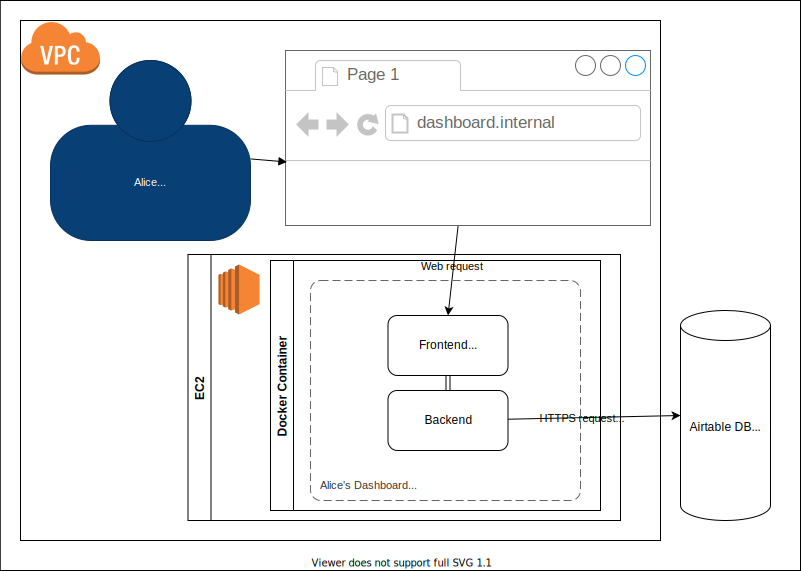

# Architecture 360 Of Alice Dashboard

This is a living document.
We keep architectural decisions in source control along with our code,
because we expect them to change, and we encourage people to open pull requests,
comment, and otherwise contribute their ideas.
All documentation is outdated the moment it is written,
this simply captures our best understanding of a problem,
and a potential solution, at a particular point in time.

## Context

Alice (our stakeholder) needs an internal dashboard for summarising her orders.
Key functionalities:
- Summary of key figures:
  - Total Orders
  - Total Orders this month
  - number of orders in progress
  - revenue
- List of most recent few orders

At a current peace she receives 80 orders a month.
The orders look evenly distributed throughout of the months.

### Assumptions
The number of orders fluctuates,
but given the data shown we could expect moderate increase.

### What issue does it cause for the business?
Without some form of dashboard Alice productivity could drop.

## Alternatives considered
The practical (cost-effective) solution would be to build the dashboard within Airtable.
That functionality is not available

# Architectural Qualities
Non-functional requirements

## Modifiability

I assume there will be over the years only small changes, new fields, aggregates or lists will be requested.
In case of any new major requirement, we have to revisit the decisions described in this document.

## Usability

### Business user
They will access the dashboard, a few times a week

### Developers
They will make modification, probably a few times a year
This document will help them to continue the project

### Maintainer, operator, on-caller
They might need to redeploy the system.
To ensure easy of deployment, we have to provide easy to follow redeployment guide.

## Security

The service is internal facing, but will have UI.

I won't implement authentication, I will deploy this to the closed internal network,
it will only be accessible for internal users.
There is no need for authorisation.

- The service will access sensitive data
- The application won't store any data
- The access API key is sensitive, that has to be provided runtime
- Outdated packages pose potential security threat

To ensure secure enough code, the service needs to be rebuilt and redeployed regularly.
Furthermore, during build time security scan needs to be done.

## Testability

It is hugely important that the shown data are correct, therefore each calculation needs to be tested.
A manual test before release would be sufficient for the rest of the application.
Issues, such as connectivity to Airtable, misaligned UI can be easily spotted and fixed.

## Availability

It is an internal tool, for a single business user.
Even prolonged downtime won't cause interruption for the business.
Downtime of Airtable fundamentally renders this service unusable, but the master of orders is Airtable,
therefore it is expected to be maintained.

## Performance

There is no special performance requirement for this service.

- A few seconds of loading time should be accepted.
- There will be only a single user.
- The nature of the data indicates the user won't need to access it very often.
- This is an internal tool.
- Fetching a few thousands records should not be problematic within an expected webpage loading the time frame.
- Airtable rate limit should be sufficient (5 requests / second).

If these change, need to revise the technologies used.

## Observability

The service won't handle data input, won't make decisions.
- Minimal level of logging (to understand the service is running) is enough.
- Basic metric of request time is enough, to spot (later) potential performance issue.

I assume there is a standard way to deliver log and metrics to Datadog or similar platform.

# Technology Choices

- NodeJS / Typescript
- NextJS + React

The domain is fairly week, no need for hexagonal architecture.
These technologies known by the team (by me).

Minimal exploration is necessary, I have not used Airtable API before.

# High level architecture overview

